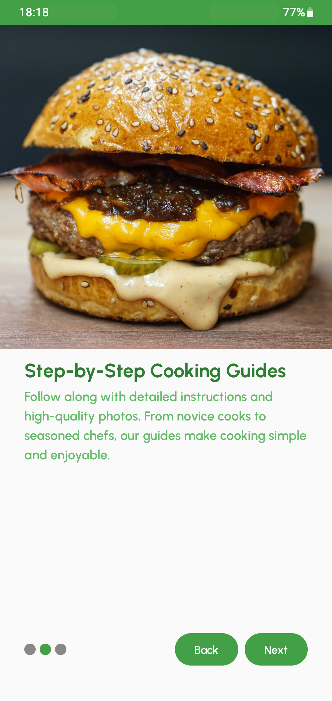
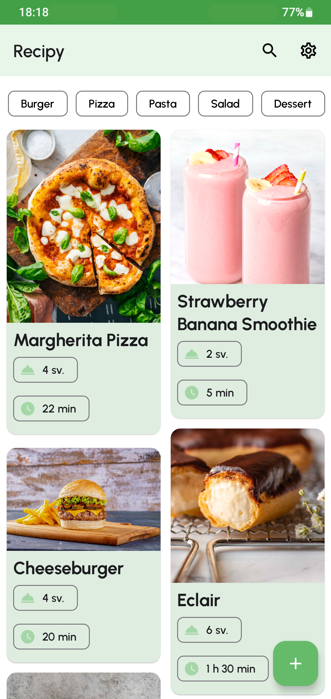
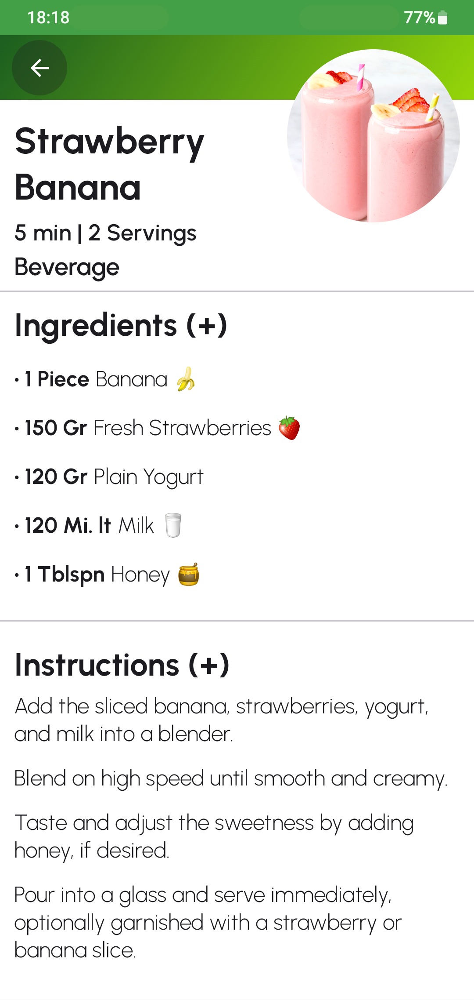
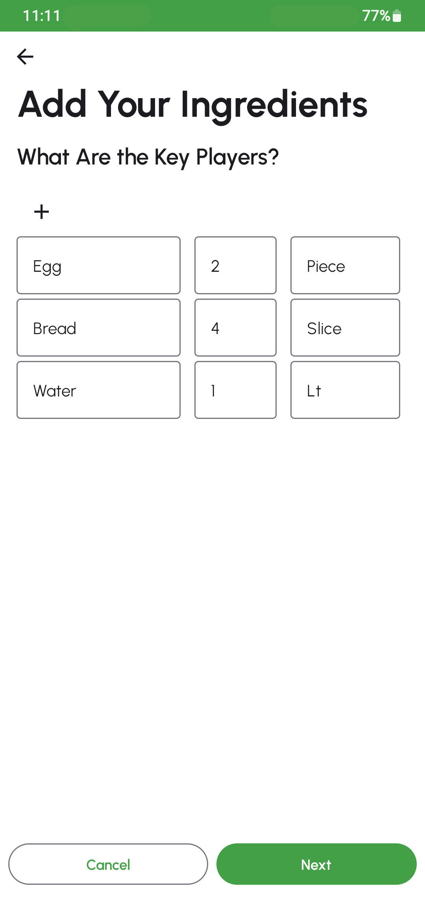

# Recipy App
Recipy is an innovative recipe management app designed for culinary enthusiasts, home cooks, and anyone who loves the art of cooking. Built with modern Android development tools and practices, Recipy offers a seamless user experience, allowing users to discover, create, organize, and share recipes with ease. The app's intuitive design and powerful features make cooking more accessible and enjoyable for everyone.

## Features
- Discover Recipes: Explore a curated selection of recipes across various cuisines and categories. Each recipe includes detailed instructions, ingredient lists, preparation times, and serving sizes.

- Manage Recipes: Save your favorite recipes for easy access and organize them into collections for meal planning and grocery shopping.

- Create and Share: Add your own recipes to the Recipy community. Share your culinary creations with friends, family, and other app users.

- Personalize Your Experience: Customize your recipe discovery with filters for dietary preferences and allergen information. The app supports multiple languages, catering to a global audience.

- Interactive Elements: Rate recipes, leave comments, and engage with the Recipy community. Your feedback helps improve the app and the cooking experience for all users.

- Offline Access: Access your saved recipes and collections even without an internet connection, thanks to local data storage.

## Technologies Used

Recipy leverages the following technologies and practices to ensure a high-quality, robust application:

- Room: For efficient data storage and retrieval, allowing offline access to recipes.

- Dagger & Hilt: For dependency injection, simplifying the architecture and making the code more modular and testable.

- Jetpack Compose: Utilized for building native UIs, ensuring a smooth and responsive user experience.

- Coroutines: For handling asynchronous tasks smoothly and efficiently, improving app performance.

- Coil Image Library: For loading and displaying images, enhancing the visual appeal of recipes.

- Gradle Version Catalogs: To manage dependencies in a centralized manner, making the build configuration cleaner and more maintainable.

- Material3 Components: The app is designed with Material3 components, providing a modern and cohesive look and feel.

## About the App

### Recipe Management:

Users can add, view, edit, and delete recipes, making it easy to manage their culinary collection.

### Initial Recipes:

The app comes pre-loaded with 13 initial recipes to get users started on their cooking journey.

### Language Support:

Recipy supports both Turkish (TR) and English (EN), making it accessible to a wider audience.

### Onboarding Page:
New users are greeted with an onboarding page that highlights the app's features and guides them through the initial setup.

### Getting Started
To get started with Recipy, clone the repository to your local machine and open the project in Android Studio. Ensure you have the latest version of Android Studio and the Android SDK installed for the best development experience.